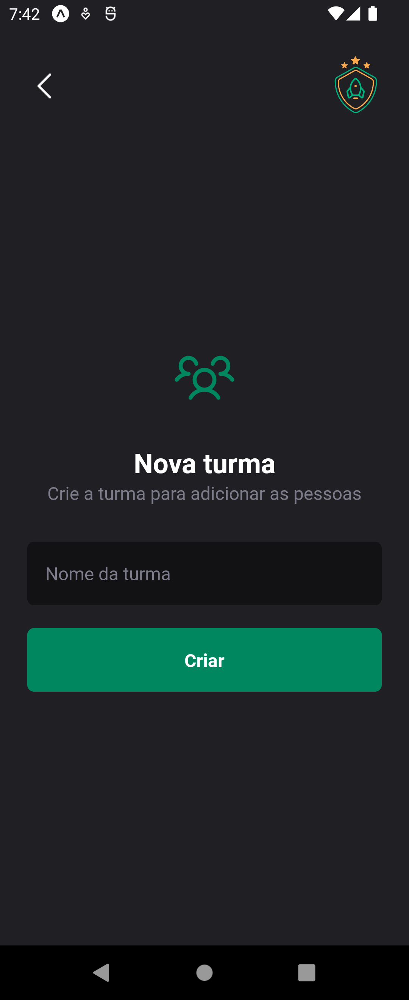
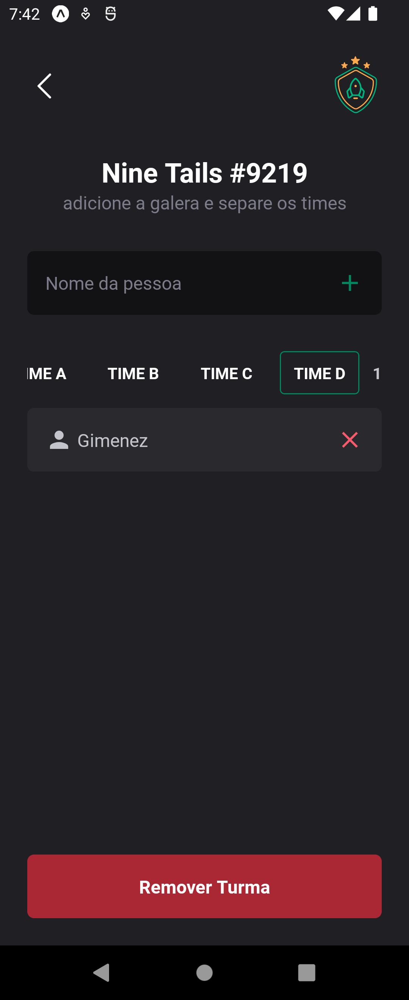

# 📁Ignite Teams

Ignite Teams é um aplicativo móvel desenvolvido em React Native com Expo Go, projetado para gerenciar turmas/grupos. Com este aplicativo, você pode facilmente criar turmas e adicionar os participantes desejados, além de ter 4 subdivisões(times). Esse projeto foi desenvolvido como parte da formação React Native na RocketSeat.

## 📔Funcionalidades

- Adicionar novas turmas à lista.
- Remover turmas da lista.
- Adicionar novas pessoas à turma-time.
- Remover pessoas da turma-time.

## 💻Tecnologias Utilizadas

- [React Native](https://reactnative.dev/)
- [Expo](https://expo.dev/)

## ✨Pré-requisitos

Antes de começar, certifique-se de ter instalado as seguintes ferramentas:

- [Node.js](https://nodejs.org/)
- [Expo CLI](https://docs.expo.dev/get-started/installation/)

## ❓Como executar o projeto

Siga os passos abaixo para rodar o projeto localmente:

1. **Clone este repositório**

```bash
git clone https://github.com/c4mpos-dev/todo-list.git
```

2. **Navegue até o diretório do projeto**

```bash
cd todo-list
```
   `Use este comando para mudar para o diretório do projeto que você acabou de clonar.`

3. **Instale as dependências**

```bash
npm install
```

4. **Inicie o servidor de desenvolvimento do Expo**

```bash
npx expo start
```

5. **Execute o aplicativo**

   `Use um dispositivo físico com o aplicativo Expo Go instalado ou um emulador Android/iOS configurado para rodar o projeto.`

## 🏛️Estrutura do Projeto

- **src/**: Contém o código-fonte do aplicativo.
- **assets/**: Imagens e outros recursos estáticos.
- **App.tsx**: Ponto de entrada principal do aplicativo.

## 📸Prévia

<table>
   <tr>
      <center>
         <td></td>
         <td></td>
         <td></td>
      </center>
   </tr>
</table>